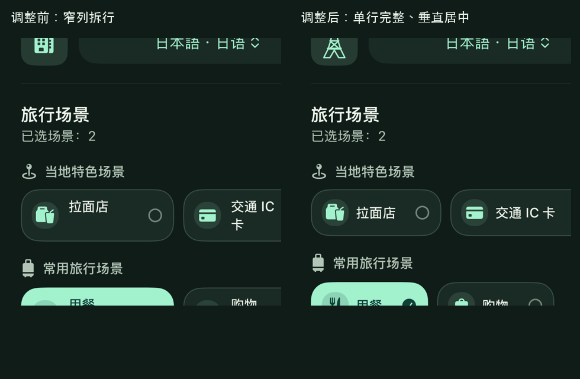
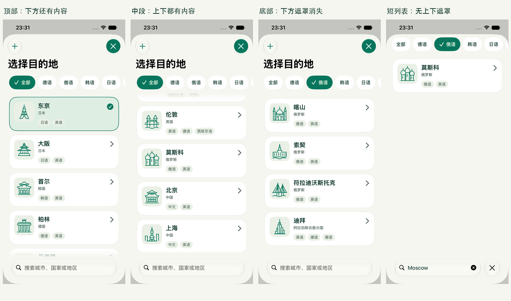

# 目的地图稿、语言筛选与滚动边缘验收

日期：2026-09-08。此轮补齐全部内置目的地的独立图稿，并更新全 App 的纵向滚动提示。早期页面截图保留为历史记录。

## 65 幅独立 SVG

每个内置目的地都对应一幅当地地标或代表物的原创矢量图，例如东京塔、大阪城、故宫、东方明珠、大熊猫、埃菲尔铁塔和悉尼歌剧院。图稿采用统一的 64 × 64 坐标、圆头线条和模板着色，但每幅轮廓独立绘制。

- [全部图稿画廊](DestinationArtwork/Gallery.html) 是 SVG 原稿审阅页，不是 App 截图。
- [逐项清单](DestinationArtwork/manifest.json) 记录 65 个稳定 ID、当地主题和资源路径。
- 唯一绘图源是 [DrawDestinationArtwork.py](../../Tools/DrawDestinationArtwork.py)，运行后同步生成 asset catalog、清单和画廊。
- App 通过 `DestinationArtwork` 复用同一套图稿，覆盖目的地列表、今日主卡、引导摘要、练习配置和生成页；自定义地点使用中性定位符。

资源保留矢量，浅深色由现有语义色着色。装饰图隐藏于无障碍树，相邻城市名称承担可访问标签。P 对话品牌标识、目录 ID、已保存的 `symbol` 字段和场景功能图标不变。

## 滚动与筛选

全部 15 处自有纵向 `ScrollView` 使用共享 `PromptiScrollView`，设置与自定义场景的 2 处原生 `Form` 应用相同边缘规则。24pt 的页面底色渐隐遮罩仅在对应方向存在未显示内容时出现：顶部不遮上沿，中间两端渐隐，到底不遮下沿，短内容两端均不遮罩。滚动位置、内容高度、视口与安全区 / 键盘 inset 变化都会更新状态；遮罩不截获手势，也不裁切系统导航标题。

目的地筛选与每个目的地支持的语言名称跟随当前界面语言，中文显示“英语 / 日语 / 俄语”等，英文显示“English / Japanese / Russian”等。支持语言改为可换行的中性小标签。筛选项未选中时只按文字留白；选中时插入勾选并自然增宽，使用一次 0.26 秒平滑过渡。筛选或搜索后列表回到顶部，选中的横向筛选项自动滚入可见区域。降低动态效果时直接切换。

场景选择改为按名称宽度排列，空间不足时整个选项移至下一行。每项名称保持单行，图标、文字和勾选垂直居中，移除原来预留的第二行高度；“交通 IC 卡”等文字不再被窄列拆开。内置场景保留完整名称，特别长的自定义场景在单项内横向查看，避免将文字缩成难以阅读的小字。

场景对照截取同一设备默认字号的实际练习页，左侧来自此前中文文案验收，右侧来自本轮最终 UI 测试。

对照图仅缩放拼排真实 XCTest 截图，没有重绘界面。原图与测试来源见 [截图清单](DestinationScreenshots/manifest.json)。

## 验证

环境：Xcode 27 beta、iPhone 17e 模拟器、iOS 27.0，竖屏、系统默认字号 `large`，现有 Demo fixtures。

- 模拟器 `build-for-testing` 和 iPhone Debug 签名构建成功。
- 76 项单元测试全部通过，覆盖全部 65 个编译后资源、滚动边界与 inset，以及原有领域、生成、安全和持久化逻辑；场景与标题修正后已再次完整通过。
- 现有引导、多空完形、口语手动输入、选择题、复习、进度和设置流程分批通过；场景与标题修正后，中文深色重新执行 4 项 UI 测试，英文浅色执行 3 项，中文浅色执行 3 项，全部通过。
- 最后的底部安全区修正后，资源 / 边界两项单测与英文练习流程通过；目的地筛选在中英文 × 浅深色四种配置下均通过，包含横向定位、当前 UI 语言名称、选中宽度增加、回到顶部、滚到底部和精确搜索短列表。
- `Tools/CheckBrand.py`、`Tools/CheckLocalization.py --stringsdata /tmp/prompti-destination-ui-build` 与 `git diff --check` 通过；本地化检查包含 645 个目录条目、185 个动态标签和 321 处编译器提取结果。
- 新版已覆盖安装至 YuanPeng 的 iPhone 17（iOS 27.0），签名验证、安装和启动成功；保留设备现有 App 数据。
- [验证摘要](DestinationUIValidation.json) 保留各批次结果与覆盖范围；[截图清单](DestinationScreenshots/manifest.json) 标明每张真实截图的来源和时间。

深色首次批次停在模拟器测试服务启动，尚未运行测试；取消后重启测试模拟器再执行，不将这次基础设施中断记为产品测试失败。英文首次筛选测试在查询屏幕外元素的可点击状态时失败，测试已改为先完整滚入视口；搜索逐字输入并断言完整文本，避免高负载下输入事件丢失导致截图含糊。

截图复核发现直接对 ScrollView 使用透明度 mask 会裁掉 iOS 27 的系统大标题；最终改为叠加页面底色渐隐，滚动状态计算保持一致，重新检查标题与列表边界。底部实底继续覆盖滚动容器的实际 inset，避免内容在透明搜索栏之后重新出现；这项修正后已完成中英文浅深色边界复测。

本轮不改变练习统计、安全审核、Provider 协议或持久化语义。运行时验收不覆盖 iPad、iOS 18 / 26 或人工 VoiceOver；降低动态效果路径保留并经代码检查，未将非常规超大字号作为验收门槛。
