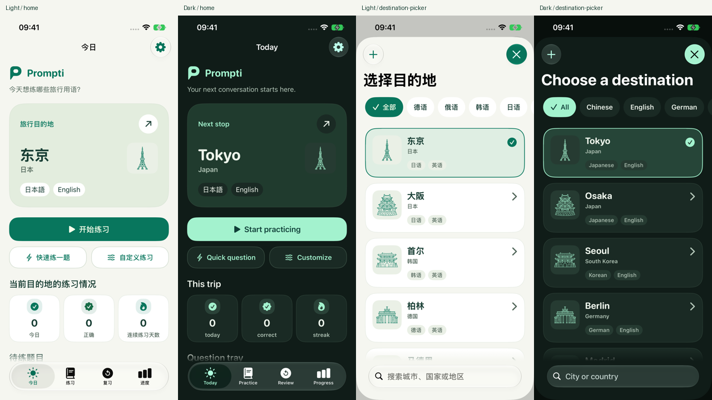

# 城市线框图标

日期：2026-09-10。

65 个内置城市使用更精细的地标 / 代表物线稿，保留圆润轮廓、单色表达和开放留白。App 继续通过 `DestinationArtwork` 使用可着色矢量模板，浅色为翡翠绿、深色为薄荷绿；没有白色底图、额外装饰背景或新增界面文案。

- [交互对照画廊](Gallery.html)：全部 65 个城市，旧版 / 新版、浅色 / 深色和 40px / 64px 预览，可搜索。
- [图稿 1](Review/sheet-1.png)、[图稿 2](Review/sheet-2.png)、[图稿 3](Review/sheet-3.png)、[图稿 4](Review/sheet-4.png)：全部矢量图的静态审阅页。它们是资源预览，不是实际 App 截图。
- [资源与来源清单](manifest.json)：稳定 ID、地标名称、模型、质量、prediction ID、原始 PNG、输入和 SVG 的路径及 SHA-256。

## 生成与源文件

使用本机 `replicate` CLI 0.1.1，模型为 `openai/gpt-image-2.5-flare`。先生成东京塔的 low / medium 两张对照，再以 medium 生成 65 个独立城市图；共 67 张输出，没有使用 high 档。

统一输入为 `aspect_ratio=1:1`、`background=opaque`、`output_format=png`、`number_of_images=1`。提示词要求单个可识别地标、黑色圆头线条、白底、选取关键结构细节，避免密集排线、文字标签、阴影和渐变。每城完整提示词保存在清单链接的 `input.json` 中。

- [生成脚本](../../../Tools/GenerateDestinationArtwork.py)：默认只准备输入，只有 `--generate` 才创建收费预测；可恢复已提交任务，已完成的输出不会重复生成。
- [原始图片与记录](../../../output/imagegen/destinations/)：`pilot` 保存两档对照，`sources` 保存全部城市的原始输出、输入、prediction 和下载清单，`before` 保存此次修改前的 SVG 供对照。
- [转换脚本](../../../Tools/PrepareDestinationArtwork.py)：Pillow 灰度阈值清理背景，归一到 1024px 画布及 896px 主体范围，轻度中值滤波；potrace 1.16 追踪轮廓并去除孤立噪点，最终映射到 64 × 64。轮廓之间的留白和背景都透明，SVG 不嵌入 PNG 或字体。
- [可编辑矢量源](../../../Tools/DestinationArtwork/)：65 份真实路径及来源清单。
- [发布脚本](../../../Tools/DrawDestinationArtwork.py)：离线同步矢量源、asset catalog 和画廊；文件内保留最初的几何稿作为历史基线。

Replicate API 的模型信息未公开可固定的版本 schema；输入字段从模型公开 API 页面核对，正式请求前执行 CLI dry run。服务返回的版本为 `hidden`，已如实记录。保存 PNG 与散列用于确定性重建；再次调用模型不保证相同图像。

离线重建：

```sh
# 首次需在工具环境安装 Pillow，以及本机 potrace 1.16。
python3 Tools/PrepareDestinationArtwork.py
python3 Tools/DrawDestinationArtwork.py
python3 Tools/CheckBrand.py
```

这批图是 AI 生成后经清理和矢量化的线稿，不称为手工原创。P 对话品牌标识仍以 `Tools/GenerateAppIcon.swift` 为唯一来源。目录 ID、目的地事实、练习统计、安全审核、Provider 协议和持久化语义均未因本次资源更新而改变。

## 实测记录

环境：Xcode 27.0 beta（27A5228h）、iPhone 17e 模拟器（Prompti Brand Final）、iOS 27.0，系统默认字号 `large`。最终验收使用 0.1.0（build 6）、提交 `7cc5394`，包含城市图标和此前的 API Key 接入调整。

- 65 幅矢量图已按四张审阅页逐张检查，额外查看了首批九城的旧版 / 新版和 40px 缩略图；地标轮廓、留白和主要结构可辨。
- 浏览器中确认画廊包含全部 65 个城市，搜索、新旧切换和浅深色切换正常；实际计算色值分别为 `#08765D` / `#A3F2CE`，图形不额外描边。画廊是资源预览，不等于 App 实测。
- `python3 Tools/CheckBrand.py` 通过；65 个源 PNG 的 SHA-256、矢量源和发布资源逐项一致，SVG 仅包含路径、分组和标题，没有嵌入位图或字体。
- 模拟器 `xcodebuild build-for-testing` 成功；构建结果位于 `/tmp/prompti-city-artwork-build`。
- `python3 Tools/CheckLocalization.py --stringsdata /tmp/prompti-city-artwork-build` 通过：629 个目录条目、185 个动态标签、297 处编译器提取结果。
- `git diff --check` 通过。

此前两次测试停在模拟器服务启动阶段，重启后仍阻塞，直接启动也在 50 秒后超时；当时本机 CPU 无空闲、平均负载约 280。这些尝试保留为历史记录，未计入通过结果。机器负载恢复后，build 6 已完成以下复测：

- 74 个单元测试、11 个 suite 全部通过，包含全部 65 个编译后城市资源、滚动边界、Provider 凭据兼容与原有领域回归。
- 中文浅色、英文深色各通过 5 项现有 UI 测试：目的地筛选 / 滚动 / 搜索、列表、首页、练习生成与答案反馈，以及对应语言的 API Key 选模 / 手填。合计 10 次 UI 测试执行，均无失败。
- 已目视检查两种配置下的首页、列表顶部 / 中间 / 底部 / 精确搜索、练习配置、生成中 / 准备完成、答案反馈和模型配置。细线在实际徽标尺寸下可辨；图标背景透明、着色正确，没有白底、裁切、错位或文字遮挡。顶部 / 底部的淡出是现有滚动提示，短列表没有残余遮罩。未因本次复核修改运行时代码。
- Debug 签名包已覆盖安装到用户 iPhone 17，设备查询确认 build 6；手机锁屏阻止自动启动，不能将安装成功记为真机视觉验收。包与安装记录见 [Debug 6](../../Debug-Build-6.md)。

保存了 38 张实际 XCTest 截图；下面仅缩放拼排原图，没有重绘界面。完整来源见 [浅色截图清单](Screenshots/Light/manifest.json) / [深色截图清单](Screenshots/Dark/manifest.json)。图标的 65 幅完整形状另由上面的矢量画廊覆盖，本次 App 截图只展示列表滚动时可见的城市。



| 实际页面 | 中文浅色 | 英文深色 |
| --- | --- | --- |
| 首页 | [查看](Screenshots/Light/home.png) | [查看](Screenshots/Dark/home.png) |
| 目的地列表 | [查看](Screenshots/Light/destination-picker.png) | [查看](Screenshots/Dark/destination-picker.png) |
| 筛选与底部 | [查看](Screenshots/Light/destinations-bottom.png) | [查看](Screenshots/Dark/destinations-bottom.png) |
| 练习配置 | [查看](Screenshots/Light/practice-setup.png) | [查看](Screenshots/Dark/practice-setup.png) |
| 生成完成 | [查看](Screenshots/Light/generation-ready.png) | [查看](Screenshots/Dark/generation-ready.png) |
| 答案反馈 | [查看](Screenshots/Light/practice-feedback.png) | [查看](Screenshots/Dark/practice-feedback.png) |
| 模型配置 | [查看](Screenshots/Light/model-zh-Hans.png) | [查看](Screenshots/Dark/model-en.png) |

本次复测矩阵为中文浅色与英文深色，并非四种语言 / 外观组合全部重跑。既有无障碍实现保持不变；未进行真机视觉、iPad、旧系统或人工 VoiceOver 验收，不把非常规超大字号列为门槛。机器可读记录见 [validation.json](validation.json)。
