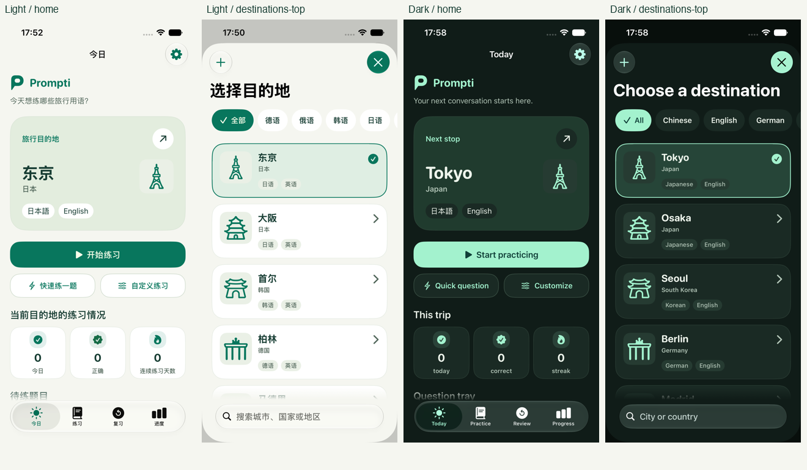

# 城市图标：粗线条与简约轮廓

更新：2026-09-17。目标是让图标在实际 40pt 城市徽标中清楚、安静、容易识别。

原细线稿中的窗格、瓦片、桥梁网格和多层建筑细节在小尺寸下过于密集。本版采用单一主体、粗圆线条与宽留白，主要依靠外轮廓和少量地标特征表达城市。成都从全身熊猫改为熊猫头像；杭州保留一座三潭印月石塔；坎昆只保留玛雅金字塔；檀香山使用冲浪板与一道海浪；洛杉矶用格里菲斯天文台替代难以缩小的 Hollywood 字样。这些是图形题材调整，未改动目的地 ID、目录事实或界面文案。

- [新旧对照](Review/Comparison.png)：六座代表城市，包含与组件一致内边距的 40pt 浅深色徽标。
- [交互画廊](Gallery.html)：全部 65 城，2026-09-10 细线版 / 本版、浅色 / 深色、40px / 64px。
- [审阅页 1](Review/sheet-1.png)、[审阅页 2](Review/sheet-2.png)、[审阅页 3](Review/sheet-3.png)、[审阅页 4](Review/sheet-4.png)：放大轮廓与实际徽标尺寸并列。
- [资源清单](manifest.json)：城市、图形题材、生成 ID、输入、源 PNG 和 SVG 的 SHA-256。
- [2026-09-10 历史验收](Review-2026-09-10.md)：旧版的结果与截图，不用于证明本版质量。

上述画廊和审阅页均为资源预览，不是实际 App 截图。

## 生成与可重建来源

使用本机 `replicate` CLI 0.1.1，模型 `openai/gpt-image-2.5-flare`，本版全部采用 `medium`，没有使用 high 或自动质量。共生成 66 张，选用 65 张。先生成东京、大阪、成都、伦敦、悉尼、莫斯科六城，检查小尺寸后扩展全套。那霸初稿过于接近鸟居，另行重画以保留双层屋顶、四柱与三个通道；被淘汰的原图独立保留。

统一输入为 `aspect_ratio=1:1`、`background=opaque`、`output_format=png`、`number_of_images=1`。提示词要求约 60px 的统一粗线（1024px 画布）、约 6–12 个结构笔画、至多三个内部识别细节，以及足够宽的内部留白；这些是生成约束，实际输出仍须逐张审阅。每座城市另有轮廓描述，明确要保留与删除的结构。

- [生成脚本与全套提示词](../../../Tools/GenerateDestinationArtwork.py)：默认只写输入，`--generate` 才执行收费生成；仅允许 low / medium，可恢复已有预测；已保存输入与新请求不同会拒绝覆盖。
- [本版原始图片与请求记录](../../../output/imagegen/destinations/bold-v2/sources/)：每城的 `input.json`、`prediction.json`、CLI 下载清单和原 PNG。
- [旧版矢量快照](../../../output/imagegen/destinations/bold-v2/before/)与[淘汰稿](../../../output/imagegen/destinations/bold-v2/rejected/)：保留来源与对照，不被发布脚本选中。
- [转换脚本](../../../Tools/PrepareDestinationArtwork.py)：背景清理、统一留白、potrace 路径追踪。没有用膨胀描边把旧版细节粘在一起。源白底在转换后为透明，图形内部留白也透明。
- [矢量源](../../../Tools/DestinationArtwork/)与[发布脚本](../../../Tools/DrawDestinationArtwork.py)：同步 asset catalog 和画廊。App 仍使用模板 SVG 的语义色，不添加位图底色、额外描边或新组件样式。
- [审阅图脚本](../../../Tools/ReviewDestinationArtwork.py)：以矢量源重建静态对照，40pt / 64pt 示例包含 `DestinationArtwork` 的 8% 内边距。

模型 schema 已经由 `replicate schema openai/gpt-image-2.5-flare` 实时核对，提交前执行 dry run。服务预测返回的版本值如实保存；PNG 与散列是离线重建依据，再次调用模型不保证相同图像。所有图稿均为 AI 生成后经逐张视觉审阅和矢量化，不称为手工原创。

离线重建：

```sh
# Pillow、potrace 1.16；审阅图另需 CairoSVG / Cairo。
python3 Tools/PrepareDestinationArtwork.py
python3 Tools/DrawDestinationArtwork.py
DYLD_FALLBACK_LIBRARY_PATH=/opt/homebrew/lib uv run --with cairosvg --with pillow python Tools/ReviewDestinationArtwork.py
python3 Tools/CheckBrand.py
```

## 本版验证

- 全部 65 城 SVG 已逐张检查放大轮廓、40pt 浅深色徽标和 64pt 浅色徽标；那霸重画后复核了双层屋顶和四柱结构。
- `python3 Tools/CheckBrand.py` 通过；65 组 PNG / SVG SHA-256 与 asset catalog 副本逐项一致，全部为 medium。
- `xcodebuild build-for-testing` 通过，构建目录 `/tmp/prompti-bold-icons-20260917`。
- 本地化目录检查通过：641 条目录文案、185 个动态标签；本轮没有新增 App 文案，构建未产出编译器 stringsdata，因此不声称完成编译器提取校验。
- SVG 总体积由 1,217,144 字节降至 189,891 字节，减少 84.4%；该数值说明路径简化程度，不替代视觉审阅。
- iPhone 17e / iOS 27.0 / Xcode 27.0（27A266a），默认字号 `large`：2 项资源 / 滚动单测通过；中文浅色与英文深色分别通过 3 项现有 UI 测试，共 6 次执行，均无失败。已目视检查两种配置下的首页、列表顶部 / 中间 / 底部、俄语筛选与精确搜索，图标透明、语义色正确，轮廓清楚且未裁切。历史测试结果不计入本轮。
- 浏览器连接不可用，因此未重新执行交互画廊的按钮和搜索测试；图稿已通过独立 SVG 渲染器检查。

[机器可读验证记录](Validation-2026-09-17.json)保留环境与复跑命令。本机高负载导致测试启动较慢，但两个结果包最终分别为 5 / 5 和 3 / 3 通过；启动期间的空白画面未计入视觉证据。

保存 16 张实际 App 截图。以下拼图只缩放拼排 XCTest 原图，没有重绘界面。



| 配置 | 截图拼图 | 来源清单 | 测试结果 |
| --- | --- | --- | --- |
| 中文浅色 | [查看](Screenshots/2026-09-17/Light/ContactSheet.png) | [8 张原图](Screenshots/2026-09-17/Light/manifest.json) | [2 单测 + 3 UI](Screenshots/2026-09-17/Light/TestSummary.json) |
| 英文深色 | [查看](Screenshots/2026-09-17/Dark/ContactSheet.png) | [8 张原图](Screenshots/2026-09-17/Dark/manifest.json) | [3 UI](Screenshots/2026-09-17/Dark/TestSummary.json) |

边界：65 幅完整形状由资源审阅页覆盖，App 截图只覆盖上述流程中可见的城市。本轮不是全部页面、真机、iPad、iOS 18 / 26 或超大字号验收；已有无障碍实现保留。

P 品牌标识仍由 `Tools/GenerateAppIcon.swift` 定义。本次不改变练习统计、安全审核、Provider 协议或持久化语义。工作区原有业务和本地化修改保留。
