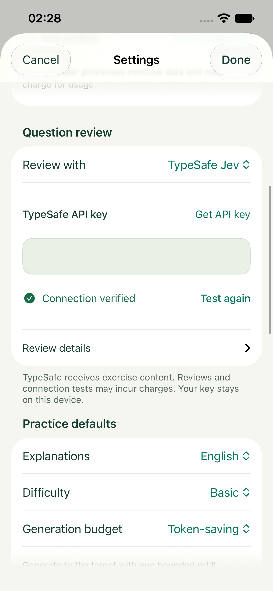
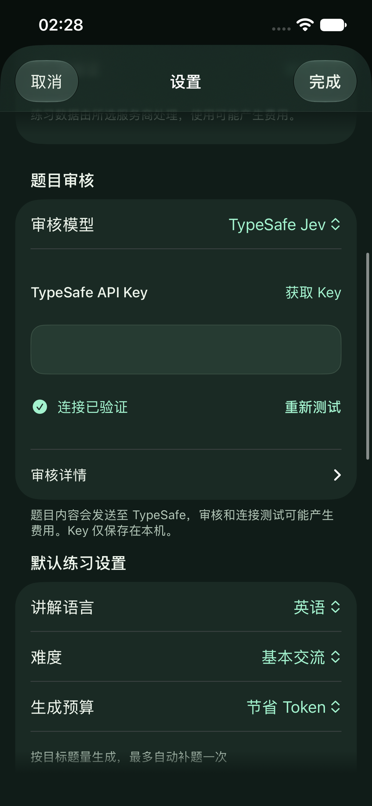
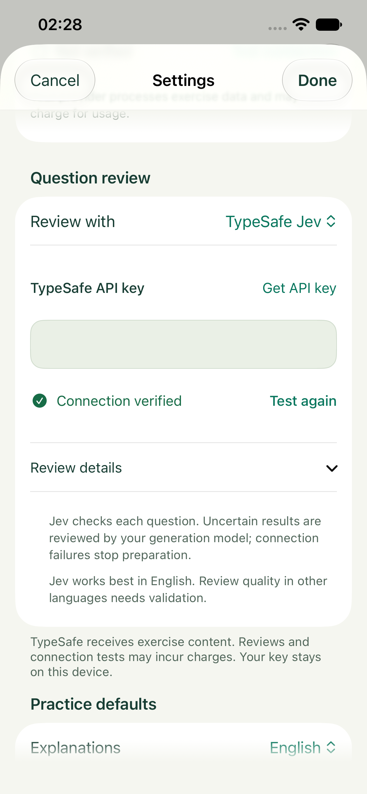
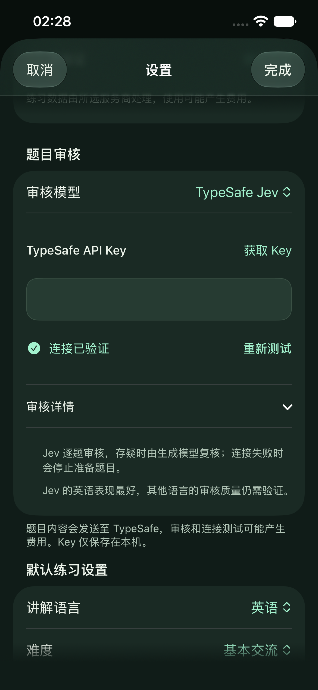
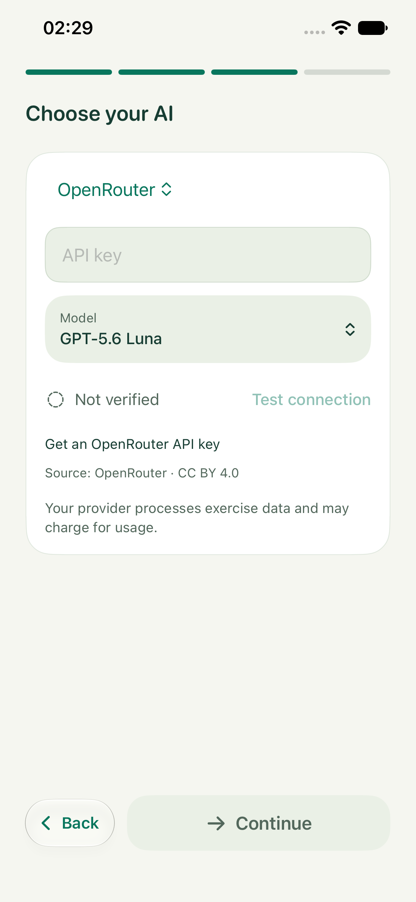
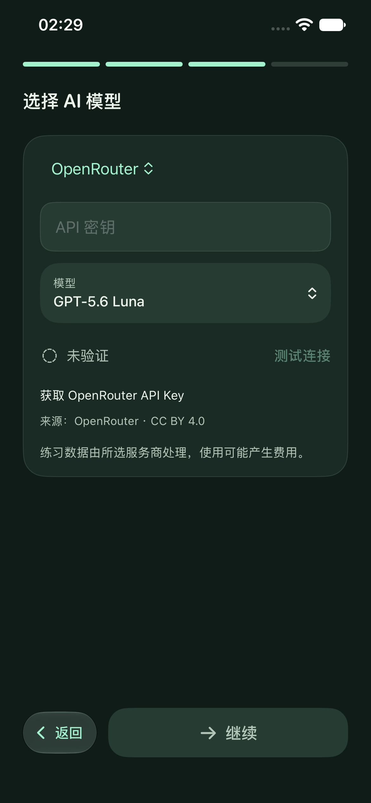

# Jev 与模型连接界面调整 · 2026-09-22

## 布局

- 题目审核拆为原生表单行：审核模型、Key 配置、审核详情及已有 Key 的移除操作。获取 Key 放在输入标题旁，费用、内容发送和本机保存信息直接显示在表单脚注。
- Jev 的复核规则、连接失败行为与语言质量边界收进“审核详情”，可就地展开。默认界面优先展示用户需要操作的控件。
- 生成模型和 Jev 共用 `PromptiConnectionTestRow`，以左侧状态、右侧测试操作替代整行实底大按钮。成功后显示“连接已验证 / 重新测试”，不再另起一段重复成功说明。
- 测试中使用真实请求状态控制的系统进度指示；Reduce Motion 使用静态沙漏。请求期间禁止重复点击；空 Key 的操作按钮弱化并禁用。失败时用错误图标、标题及具体原因，仍可编辑 Key、重试或取消。
- Key 字段保持安全输入，点击测试后收起键盘；共享组件在宽度不足时允许状态与操作纵向排布。所有新增文案具有英文与简体中文翻译。

审核政策、Provider 协议、Keychain 保存/取消/删除时机和练习统计均保持原行为。新增失败启动参数仅供 DEBUG UI 测试使用，不发送网络请求。

## 验证记录

- Swift 严格并发、warnings-as-errors 模拟器构建通过；Xcode 仅保留未依赖 AppIntents.framework 的元数据提取提示。
- 137 项既有单元 / 合约 / 持久化测试通过（`/tmp/Prompti-Jev-UI-0922.xcresult`）。该结果包包含早期 UI 定位失败，设置 UI 以最终 verified 结果包为准。
- 品牌检查、编译提取本地化检查（686 个目录条目、185 个动态标签、342 处提取使用）及 `git diff --check` 通过。
- 最终 6 项 UI 回归全部通过（`/tmp/Prompti-Jev-UI-0922-verified.xcresult`）：Jev 英语浅色/中文深色配置、等待与失败恢复、Key 验证失效和保存/取消/删除、详情展开、生成模型中英文选模/手填及未验证禁止继续。早期失败是展开内容继承父级 accessibilityIdentifier 导致的测试定位问题，已改为核对实际本地化说明内容。
- 设备为 iPhone 17e 模拟器 / iOS 27.0，默认字号；英语浅色与简体中文深色，检查键盘收起后的输入、状态、操作、脚注和展开说明。

## 实际 App 截图

| 页面 | English / 浅色 | 简体中文 / 深色 |
| --- | --- | --- |
| Jev 连接成功 |  |  |
| 审核详情展开 |  |  |
| 模型连接 |  |  |

[测试中](JevConnectionScreenshots/jev-testing-en-light.png) · [连接失败](JevConnectionScreenshots/jev-failed-en-light.png) · [截图清单](JevConnectionScreenshots/manifest.json)

图片来自实际 App 的 XCTest 附件，使用合成 Key 和 DEBUG 连接响应，安全字段由系统遮蔽。它们不代表真实 TypeSafe 账号连接或审核质量测试。未做物理 iPhone 安装或完整 VoiceOver 验收；默认字号为此次视觉范围。
