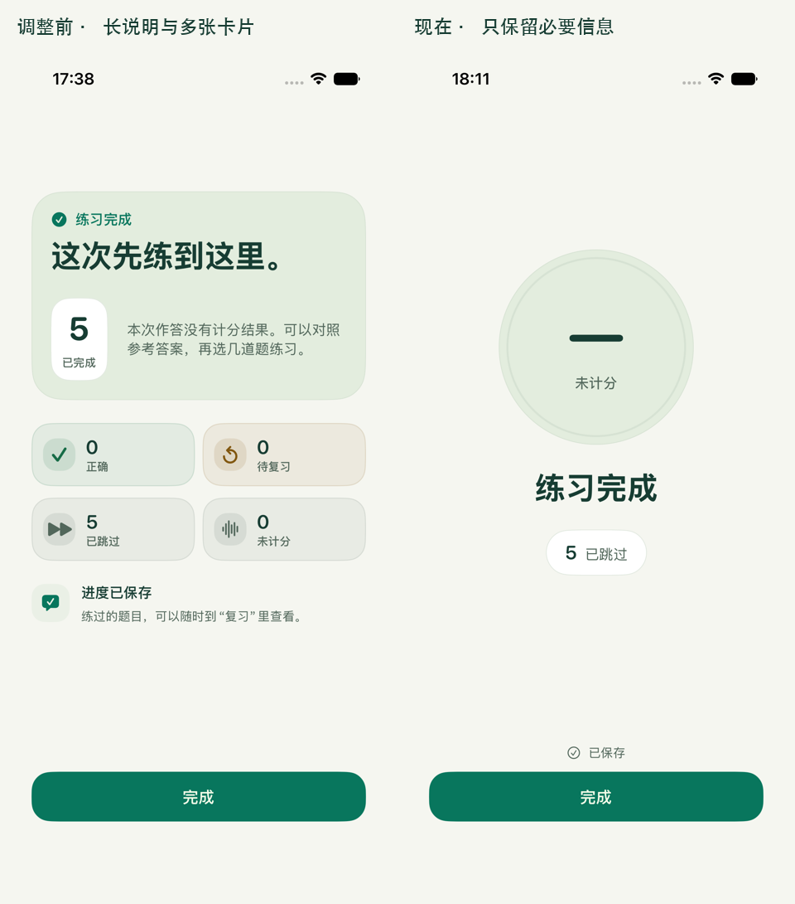

# 完成页与庆祝动效验收

日期：2026-09-08。此版本替代 [第一次紧凑布局](Summary-Layout-Review.md)，此前截图保留为历史记录。

完成页改为圆形结果、短标题和一行非零统计，移除说明段落与分散的四张统计卡。“已保存”紧邻底部“完成”按钮。圆形使用共享 `promptiHeroSurface(in:)`，统计使用 `promptiSurface()`；数字、间距和浅深色均来自设计系统。

| 作答状态 | 结果展示 |
| --- | --- |
| 整组全对 | 正确率、“全部答对！”、全对徽标 |
| 其他完整练习 | 正确率或“— / 未计分”、“练习完成” |
| 题目未补齐 | “先练到这里”、已准备题量、实际统计 |

对照图只缩放拼排同一设备、默认字号下的实际 App 截图，没有重绘界面。

## 全对庆祝

整组题量已齐、每题均判定正确时，播放一次 1.8 秒礼花。42 个小纸片采用品牌语义色，从两侧散开后淡出；动画不循环、不拦截触控。保留现有完成触感，不叠加第二次触感。

正确率仍只按原来的可计分作答计算。答对一题且其他题跳过，即使显示 100%，也不会出现全对标题、徽标或礼花；未计分、已反馈、答错和未补齐题量同样不触发。新增判断只用于展示，不写入数据或改变统计口径。

降低动态效果时保留静态结果与徽标，直接略过礼花；离开页面、进入后台或中途开启降低动态效果，会立即移除动画。1.8 秒结束后移除 `TimelineView`，不保留后台刷新。

[查看实际礼花录屏](ResultCelebrationScreenshots/Celebration.mp4) · [GIF 预览](ResultCelebrationScreenshots/Celebration.gif)

录屏来自简体中文浅色下的一题复习：提交正确答案后进入完成页。视频只截取并转码，没有重绘、合成界面或改变播放速度；GIF 缩至 390px、20fps，仅播放一次。录屏与静态截图分别保留，动画后的静态结果见下方浅色原图。

## 实测

在 iPhone 17e 模拟器、iOS 27.0、Xcode 27 beta、竖屏、系统默认字号 `large` 下，使用 Demo fixtures 执行实际练习与复习流程。[截图清单](ResultCelebrationScreenshots/manifest.json) 记录语言、外观、测试与采集时间。

| 状态 | 简体中文浅色 | 简体中文深色 |
| --- | --- | --- |
| 整组全对（1 / 1 复习） | [静态原图](ResultCelebrationScreenshots/zh-Hans/light/practice-summary-correct.png) | [礼花中的原图](ResultCelebrationScreenshots/zh-Hans/dark/practice-summary-correct.png) |
| 一题答错、四题跳过 | [原图](ResultCelebrationScreenshots/zh-Hans/light/practice-summary-incorrect.png) | [原图](ResultCelebrationScreenshots/zh-Hans/dark/practice-summary-incorrect.png) |
| 全部跳过 | [原图](ResultCelebrationScreenshots/zh-Hans/light/practice-summary.png) | [原图](ResultCelebrationScreenshots/zh-Hans/dark/practice-summary.png) |
| 部分完成 | [原图](ResultCelebrationScreenshots/zh-Hans/light/practice-summary-partial.png) | [原图](ResultCelebrationScreenshots/zh-Hans/dark/practice-summary-partial.png) |

英文浅 / 深色均检查全对和 0% 正确率，共保留 12 张完成页原图。数字和标题未截断，必要统计可见，底部操作位于安全区域内。

- 构建、`Tools/CheckBrand.py`、`Tools/CheckLocalization.py --stringsdata /tmp/prompti-chinese-copy-build` 与 `git diff --check` 通过。
- 18 项领域测试通过；新增全对判断测试覆盖完整全对、单题复习、空集、跳过、未计分、已反馈、答错和题量未补齐。
- 三个现有 UI 测试覆盖完成返回且不重新生成、错题复习与进度、补题失败后部分完成。最终外观在中文浅 / 深色各执行三项，英文浅 / 深色各执行复习与进度一项，共 8 次通过；[验证结果](ResultCelebrationValidation.json) 保留各批次摘要。
- 复习流程同时断言“全部答对！” / “All correct!”；静态截图等待礼花结束后采集。深色中文首次采集仍保留动画中的画面，英文两种外观及最终中文浅色均为静态结果。

本轮未进行真机、iPad、iOS 18 / 26、人工 VoiceOver 或系统降低动态效果开关的运行时验收。降低动态效果、后台和任务取消路径已做代码审查；未将非常规超大字号作为验收门槛。
