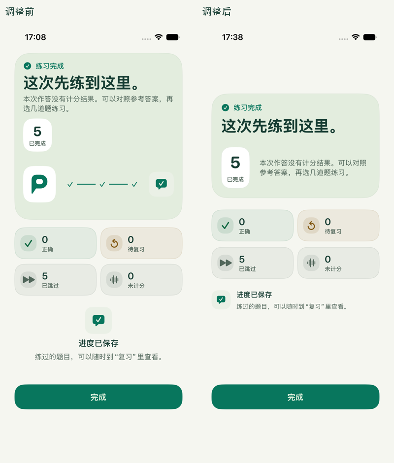

# 练习完成页布局验收

此页保留第一次紧凑布局的历史记录。后续已移除长段说明并加入全对庆祝，最新实现和实测见 [完成页与庆祝动效验收](Result-Celebration-Review.md)。

日期：2026-09-08。基于 [中文文案修订](Chinese-Copy-Review.md) 后的界面，调整“这次先练到这里。”所在的结果卡。

原布局将标题、说明和题数徽标放入 `ViewThatFits`，长文案会触发纵向布局，使小徽标独占一行；其下还有固定 112pt 的装饰进度图。两部分叠加，让结果卡显得空而高。

现在标题单独占一行，数值与结果说明并排呈现，移除重复的品牌 / 对话进度装饰。四项统计保留原有含义，“进度已保存”收成横向提示。继续使用共享字阶、间距、语义色和表面组件，底部“完成”操作仍固定在安全区域。整体内容保持居中，卡片按实际内容决定高度。

对照图仅缩放并排两张实际 App 截图，没有重绘。相同的全部跳过状态、相同设备和默认字号下，绿色卡片的可见高度由约 1,039px 减至 650px，缩短约 37%；测量取背景色覆盖过半的横向像素行，仅用于说明这组截图的变化。

## 实测环境与范围

iPhone 17e 模拟器，iOS 27.0，Xcode 27.0 beta，竖屏，系统默认字号 `large`。全部题目为 Demo fixtures，截图来自 XCTest 附件。[原图与采集清单](SummaryLayoutScreenshots/manifest.json) 保留测试方法、语言、模式与时间。

| 状态 | 简体中文浅色 | 简体中文深色 |
| --- | --- | --- |
| 全部跳过 | [原图](SummaryLayoutScreenshots/zh-Hans/light/practice-summary.png) | [原图](SummaryLayoutScreenshots/zh-Hans/dark/practice-summary.png) |
| 有计分结果：100% | [原图](SummaryLayoutScreenshots/zh-Hans/light/practice-summary-correct.png) | [原图](SummaryLayoutScreenshots/zh-Hans/dark/practice-summary-correct.png) |
| 有计分结果：0% | [原图](SummaryLayoutScreenshots/zh-Hans/light/practice-summary-incorrect.png) | [原图](SummaryLayoutScreenshots/zh-Hans/dark/practice-summary-incorrect.png) |
| 部分完成 | [原图](SummaryLayoutScreenshots/zh-Hans/light/practice-summary-partial.png) | [原图](SummaryLayoutScreenshots/zh-Hans/dark/practice-summary-partial.png) |

英文浅 / 深色检查有计分结果的两种布局，原图收录于同一清单。数值保持完整，说明自然换行，统计与操作按钮可见。

## 验证

- `python3 Tools/CheckBrand.py`、构建和本地化提取检查通过；未新增用户可见文案。
- 复用三个现有 UI 测试：完成后返回设置且不重新生成、错题复习与进度数据、补题失败后部分完成。只给已有用例添加截图附件，没有新增业务或计分逻辑。
- 简体中文浅 / 深色分别执行上述三个 UI 测试，全部通过；英文浅 / 深色分别执行错题复习与进度测试，也全部通过。本轮共 8 次 UI 测试执行，保留 12 张完成页原图，覆盖全部跳过、0% / 100% 正确率和部分完成。
- 保留滚动、无障碍字号下纵向排布与 VoiceOver 分组；入场动画改为短暂淡入，降低动态效果时直接显示。没有删除现有适配，未将非常规超大字号作为验收门槛。

本轮没有改变作答事件、统计、保存、补题、退出或返回路径。未进行真机、iPad、旧系统及全部异常状态的视觉验收；页面出现已反馈题目的提示分支仍沿用原有实现，本轮未单独截图。
