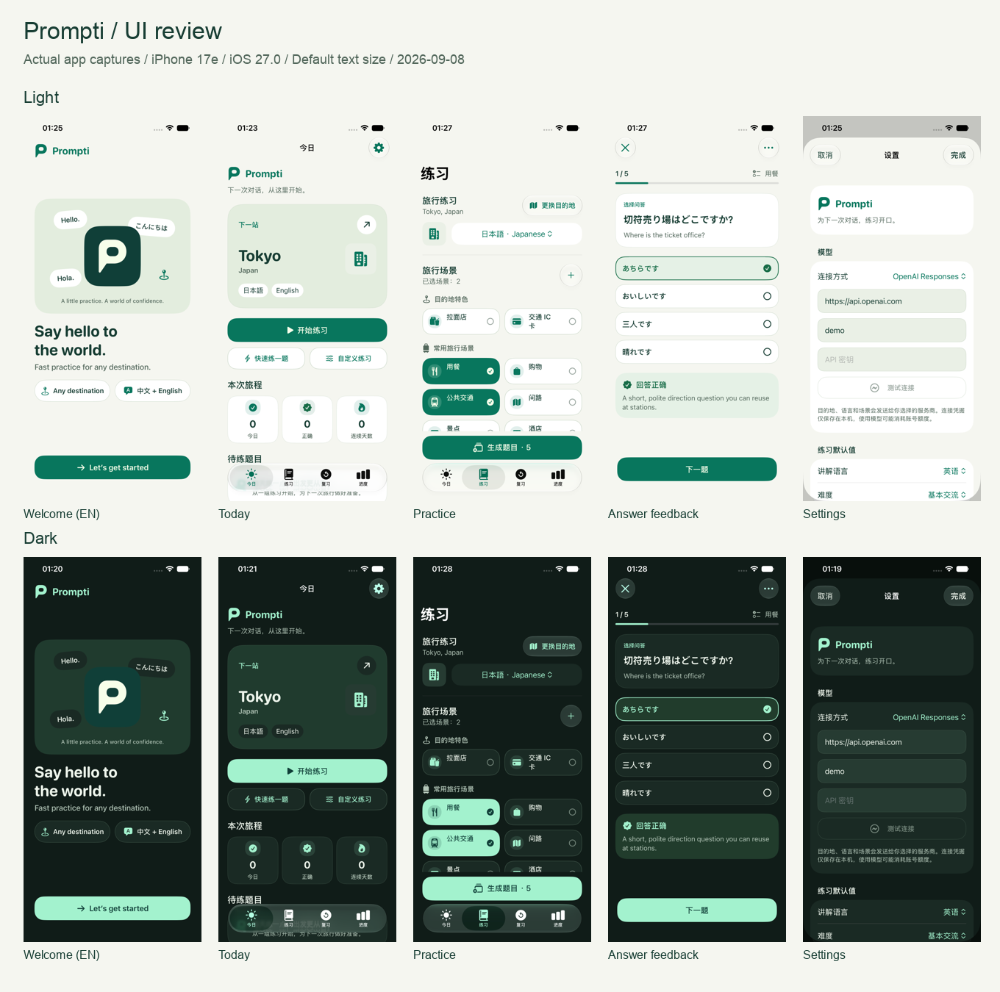

# 品牌与 UI 验收记录

日期：2026-09-08。实施规范见 [品牌与 UI 开发规范](../../.agents/13-brand-and-ui-guidelines.md)，图标与商店排版见 [品牌说明](README.md)。

后续模型预设与中英文目录 / 动态文案完善的实际截图和验证范围见 [模型与本地化验收](../Model-and-Localization-Review.md)。

本轮把 P 对话标识延伸到全部 11 个功能页面及 App 的恢复界面。翡翠绿用于操作，暖中性表面用于阅读；深色主操作采用薄荷底配深绿文字。目的地继续用城市、地标和场景表达旅行。

[打开实际截图画廊，切换浅色 / 深色](UI-Review.html)。36 张原始截图与来源保存在 [UIScreenshots](UIScreenshots) 及 [截图清单](UIScreenshots/manifest.json)；下面的对照图仅缩放拼排原图，没有重绘界面。

## 实现覆盖

| 页面 / 状态 | 实现结果 |
| --- | --- |
| 欢迎与五步引导 | 同源 P 字标、多语言问候主视觉，统一选中态、偏好卡片和操作按钮 |
| 今日 | 品牌抬头、目的地主卡、统一统计块和练习入口 |
| 目的地 / 筛选 / 自定义 | 地标徽标、中性卡片、带勾选的筛选项、统一输入区 |
| 练习配置 / 自定义场景 | 共用场景选择、主操作、字段和错误提示 |
| 生成 / 部分完成 / 失败 | 对话阶段图形、真实状态文案、不透明内容面和恢复操作 |
| 选择 / 多空完形 | `PromptiAnswerStyle` 统一未选、选中、正确、错误；提交后禁用改答，`PromptiAnswerButtonStyle` 保持答案阅读对比；图标与无障碍值共同表达状态 |
| 口语 / 反馈 | 统一播放与录音按钮；原生 `TextEditor` 支持拒绝麦克风权限后的手动编辑 |
| 完成 | 对话完成主视觉、语义统计与保存结果 |
| 复习 / 筛选 / 隔离 | 中性卡片、明确的复习和警告状态 |
| 进度 / 空状态 | 单一绿色图表、统一统计、说明和空状态 |
| 设置 / Provider / 授权码 | P 字标、原生表单、统一字段、按钮和提示 |
| 学习数据不可用 / 会话不存在 | 共用 `PromptiRecoveryView` 与明确的恢复操作 |

实现审查覆盖上表全部页面；运行时截图与交互测试的范围单独记录，不能由代码覆盖推断全部状态均已实测。

## 验证环境与结果

- iPhone 17e 模拟器，iOS 27.0，竖屏，默认字号（系统 `large`，并非无障碍大字号）。
- Xcode 27 beta；App 最低部署版本保持 iOS 18。
- 使用现有 Demo fixtures 和独立测试数据；练习内容与统计是测试数据，不是用户数据。
- 最终代码 `build-for-testing` 成功。
- `python3 Tools/CheckBrand.py` 通过：语义色对最低文本对比为 4.64:1，主色与 AccentColor 一致，矢量资源及不透明图标格式符合约定。
- Swift Testing：66 项、9 个 suite 全部通过。
- 现有 25 个 UI 测试方法分批全部通过，覆盖引导、主页入口、目的地联动、生成 / 部分成功 / 失败 / 取消、选择 / 多空 / 口语权限降级与手动编辑、已评分题不可跳过、提前结束、完成、复习和进度。
- 最终答案按钮修正后重新构建，浅 / 深色分别重跑多空、选择题视觉流程和已评分题不可跳过，共 6 次通过；确认提交后答案不可修改，文字不因禁用而变淡。
- 默认字号浅 / 深色实际截图已检查：欢迎、今日、练习配置、生成和选择反馈、设置。另检查深色五步引导、口语键盘与反馈、复习 / 进度空状态及有数据状态，以及浅色目的地、生成失败 / 部分成功和完成页。截图中的滚动页面只展示当时的可见区域；按钮与底部安全区域可用。
- 英文欢迎页与简体中文主要流程已检查。本轮新增品牌文案在 String Catalog 中包含英文和简体中文。
- `git diff --check` 通过。具体通过的方法与批次见 [UI-Validation.json](UI-Validation.json)。

最初把测试与截图放在外置盘时，模拟器服务返回文件写入权限错误；改用本机临时目录运行再复制结果。随后第一批浅色测试在 `testHomeStartsDefaultPracticeSet` 的事件合成阶段停滞，主动取消了该批次（已完成 66 项单测、7 项 UI）。该用例在后续浅色批次通过；最终 25 项是跨批次去重结果，不是一轮未经中断的完整测试。

## 验收边界

- 图标 [Preview.html](Preview.html) 是 Icon Composer 输出及商店排版示意，不是实际 App 截图，也不表示已经在 App Store 上架。
- 本轮不包含真机、iPad、iOS 18 / 26 运行时、真实模型账户授权、真实录音与双设备 iCloud 的发布验收。
- 自定义目的地 / 自定义场景、授权码表单、隔离筛选和学习数据恢复界面完成代码与共享组件审查，尚未逐一采集运行时截图；它们不能计作已逐页实测。
- 保留现有 Dynamic Type、Reduce Motion、降低透明度与颜色区分适配；按当前约定，未把非常规超大字号设为本轮门槛。保留实现不等于已经逐项完成人工 VoiceOver 审核。
- 品牌调整不改变练习统计、安全审核、Provider 协议或持久化语义。工作区原有领域与数据层改动保留。

## 后续修改的复核入口

1. 从 `Tools/GenerateAppIcon.swift` 修改标识并重新生成资源；App 内使用 `PromptiBrandMark` / `PromptiWordmark`。
2. 从 `PromptiTheme.swift` 修改语义 token；页面复用共享组件。
3. 运行品牌检查、构建及相关已有测试；从实际 App 补充默认字号浅深色截图，更新这份记录。
4. GitHub Actions 的 `Brand contract` 执行静态规则；PR 模板要求说明实际视觉范围与未完成项。
