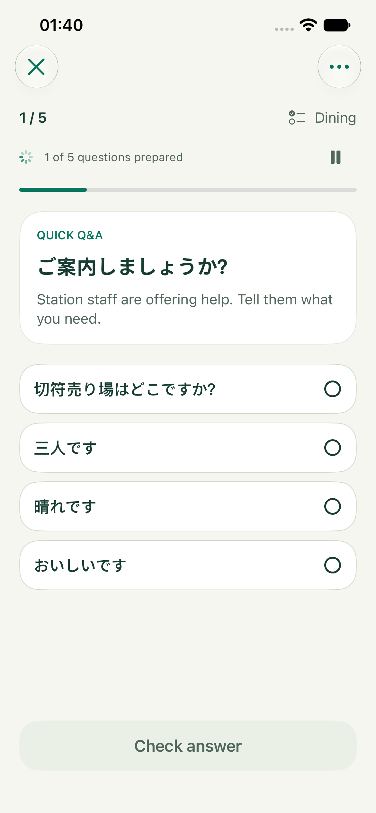
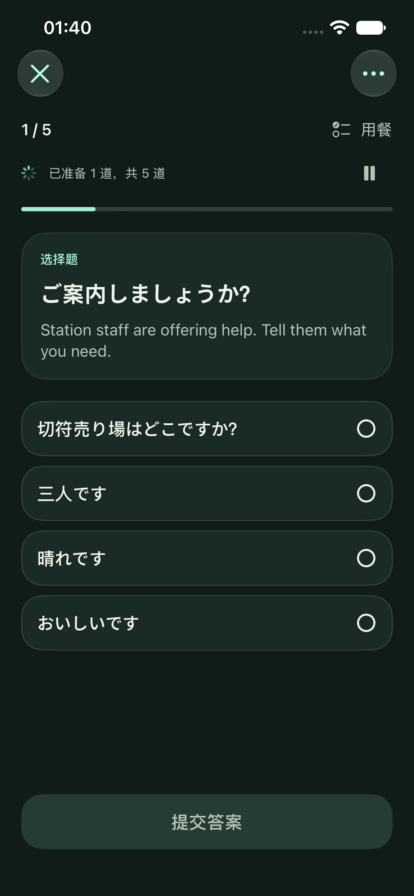
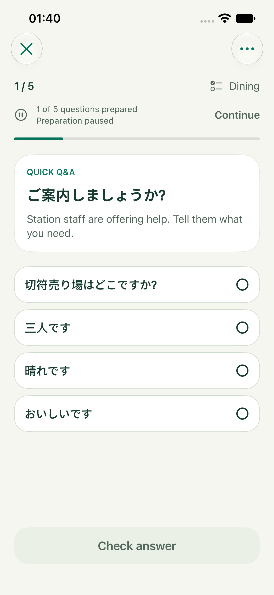
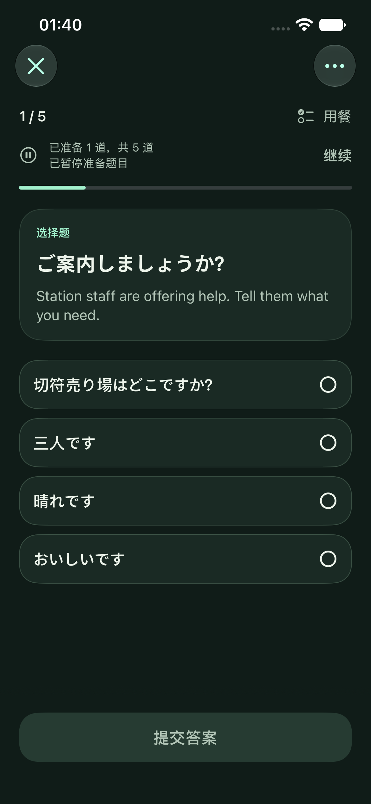
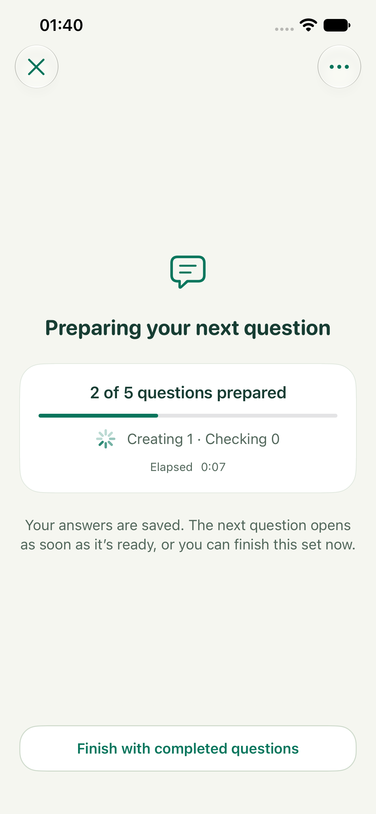
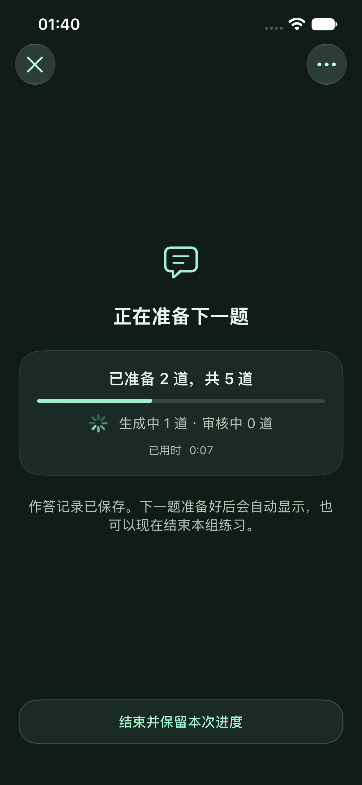

# 2026-09-22 生成效率与补题体验

## 实现

- 单题调度明确指定题型，轮换选择题、完形与口语，只发送该题型的生成说明和结构。游客角色、事实、难度、文化、去重及六项独立审核保留；新题 promptVersion 为 7。
- 结构化请求不再在 user prompt 重复发送协议字段中已有的 JSON Schema。JSON mode 与 Anthropic 文本模式继续携带完整结构；不新增协议字段或修改 reasoning 策略。
- 固定要求置于变化的场景、历史和题目数据前，JSON key 排序稳定，为可支持的服务商保留可复用前缀。实际缓存命中由服务商决定。
- 本轮 client 按具体 schema 记忆已经成功的 JSON 降级，后续同 schema 请求不再先失败一次。新的 client / 生成任务、其他 schema 独立，不永久修改连接能力；fallback 失败不记忆。
- 已准备题目的开练入口在补题中保持可用。练习页显示准备题数和暂停 / 继续 / 重试；等待下一题显示实际生成 / 审核数及本次已用时，下一题保存后自动进入。
- 等待中可立即按已完成题目结束，取消剩余工作并保留作答。暂停、切到后台或离开会话后不会因自动进入 / 恢复前台再次发起生成；明确继续或重试才生成缺题。临时 inactive 不取消生成。
- 旅程图只按已保存的合格题前进，部分成功不绘制为全部完成。保留 Reduce Motion 和阶段的 VoiceOver 状态。

## 请求大小检查

英语、东京、基础难度、单题 fixture；比较同版本完整三题型说明与实际单题型说明，单位是 UTF-8 字节，**不是 token 或耗时**。

| 单题类型 | 完整说明 → 单类型说明 | 完整 schema → 单类型 schema |
| --- | --- | --- |
| 选择题 | 6981 → 6089 | 1452 → 722 |
| 完形 | 6981 → 6121 | 1452 → 1124 |
| 口语 | 6981 → 5991 | 1452 → 1016 |

此外，结构化请求的 user prompt 内不再重复 schema。以上只证明请求内容更少，不证明具体服务商提速比例；思考、排队、网络和拒绝重试仍会影响实际耗时。远端最多 3 条生成 / 审核链并行，Apple 串行，单题独立审核、逐题保存、最多两次重试及预算 / 截止上限保持一致。

## 验证范围

- Xcode iOS Simulator 构建与 Swift 6 严格并发检查通过，Swift warnings as errors；Xcode 仅提示未依赖 AppIntents.framework，跳过对应元数据提取。
- **119 项单元 / 合约 / 持久化测试通过**（12 suites）。包含混合题型轮换、非请求类型拒绝、单题生成与独立审核、增量保存、拒绝重试上限、预算、取消、失败 / 暂停不自动重启、schema 降级复用与隔离、所有推荐 Provider 的 reasoning / 请求合约及原有统计回归。
- **9 项 UI 回归通过**：浅深色暂停 / 继续 / 等待中结束（2 项）、补题期间可开练、追加不重置题目、补题失败后部分完成、失败保留已准备题、取消回首页、生成 / 选择 / 提交主流程、前后台切换不自动重发。
- `CheckBrand.py`、`CheckLocalization.py --stringsdata`、`git diff --check` 通过；本地化覆盖 659 个 catalog entries、185 个动态标签、322 个编译器提取用例。
- 实际 App 运行于 **iPhone 17e 模拟器、iOS 27.0**，设备名 `Prompti-Generation-Review`。英语浅色、简体中文深色，系统默认 `large` 字号；检查了可见选项、固定操作区、暂停后题干保持、等待状态、补题时开练入口。保留无障碍实现，未宣称完成 VoiceOver 全流程或超大字号验收。

测试结果位于 `/tmp/Prompti-Generation-0922-verified.xcresult`（119 单元 + 8 UI）、`/tmp/Prompti-Generation-0922-background.xcresult`（前后台切换）。最终默认字号截图复查记录在 `/tmp/Prompti-Generation-0922-visual-final.xcresult`。临时 xcresult 路径不是仓库发布产物。

## 实际 App 截图

| 状态 | English / 浅色 | 简体中文 / 深色 |
| --- | --- | --- |
| 练习中补题 |  |  |
| 已暂停 |  |  |
| 等待下一题 |  |  |

[初始等待页](GenerationReview/2026-09-22/generation-working.png)与[补题期间开练](GenerationReview/2026-09-22/top-up-start-available.png)另保留中文浅色截图。所有图片来自实际运行 App 的 XCTest 截图，非概念图。

未进行真实付费 Provider 调用，未访问用户 API Key，未证明真实 DeepSeek / OpenRouter 延迟、缓存命中率或题目质量改善。Apple 真机生成和物理 iPhone 安装 / 视觉验收不在此次实测范围。UI 使用 demo fixture；截图中的题目与响应速度不能作为模型质量或性能证据。
