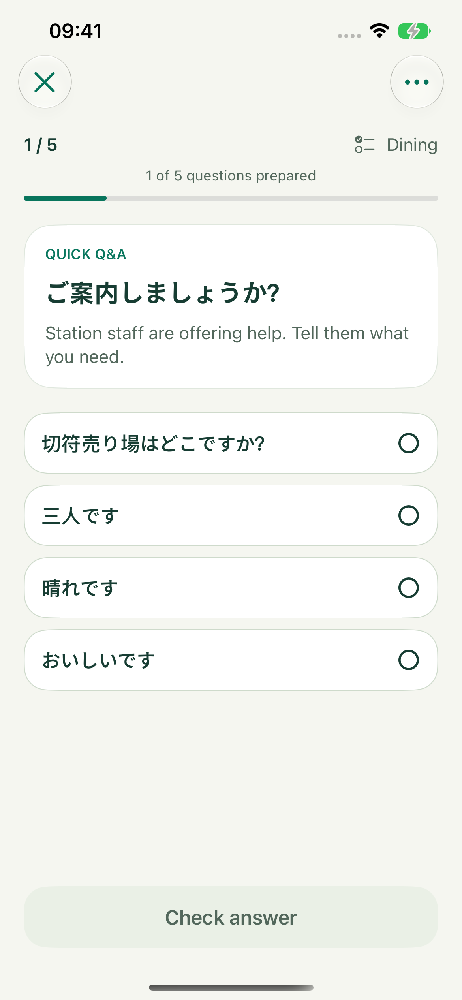
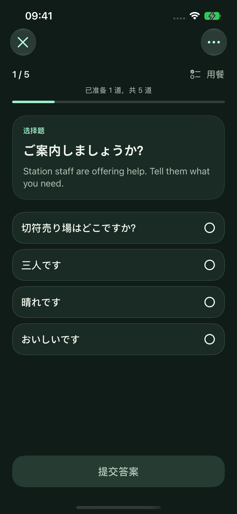

# 2026-09-20 生成问题修复与验收

## 修复内容

1. **游客视角**：固定学习者为游客、顾客、住客、乘客或访客。服务人员可作为对话另一方，不能成为学习者扮演的身份。选择题回复、完形填完整句和口语样例都按此约束；审核角色反转时必须 `scene=false`。移除“变化说话角色/方向”的旧要求，新题 promptVersion 为 6。
2. **自动重生成**：每个候选位置最多初次生成 + 2 次重试；结构不合格、重复、审核拒绝、缺失审核结论、截断或可恢复错误自动补该题。已通过题目继续保留。认证、权限、余额、限流、配置和取消不反复调用。次数、总时长、预生成额度任一上限先到即停止，才出现手动恢复操作。
3. **逐题入库**：每个请求只出 1 题并独立审核。远端最多 3 条链并发，Apple 串行；过审立即发事件并保存，首题就能开练。首页预生成也使用逐题保存，额外候选和重试逐次预留每日准备额度。保存失败终止调度，已保存题不丢失。
4. **DeepSeek 请求**：直连关闭思考时只发送 `thinking.type=disabled`，移除不受 DeepSeek Chat 支持的 `reasoning_effort=none`。OpenRouter 继续对可关闭思考模型发送 `reasoning.enabled=false`，强制思考模型使用 low；要求路由支持请求参数，并按 latency 优先选择。仅无支持所需参数的端点时允许 JSON Schema 降级为 JSON mode，模型不存在的 404 仍直接失败。

单次生成/审核原来的 60s 硬截止调整为 120s，同时同步 URLRequest 和 URLSession resource 超时，保留取消与总时长限制。整组上限为 `min(600, max(180, 本次缺题数 * 30))` 秒。生成输出 cap 从 12000 降到 4000 token，单题审核等为 2000。逐题请求会重复发送部分上下文，不能声称整组 token 必然减少；宽松候选和有限重试也会增加请求数。

## 超时证据边界

- 当前代码原来同时存在 60s 请求超时/管线截止和 90s resource 上限。即便服务商仍保持连接，超过本地硬截止也会取消。这是代码中可验证的行为，不能据此判定每一次用户超时都源于同一个原因。
- [DeepSeek 思考模式官方说明](https://api-docs.deepseek.com/guides/thinking_mode) 的 Chat 参数以 `thinking.type` 开关控制，effort 为 low/high/max，默认开启且为 high。`none` 属于另一接口的表达，不应在此用于关闭。
- [DeepSeek 限流与连接说明](https://api-docs.deepseek.com/quick_start/rate_limit) 明确非流式请求可能收到空行 keep-alive；这表示连接还活着，不等于题目已经生成。[JSON 输出说明](https://api-docs.deepseek.com/guides/json_mode) 也提醒偶尔返回空内容，客户端应作为不合格输出进行有界恢复。
- [OpenRouter 当前模型目录](https://openrouter.ai/api/v1/models) 仍列出 V4.1 Flash 为可关闭思考，默认开启/high，支持 low。读取到的公开字段见 [能力快照](GenerationReview/2026-09-20/deepseek-capabilities.json)。模型端点目录显示各后端支持的 structured output 参数有差异，因此路由必须遵守所发参数。
- 本轮没有访问用户密钥或调用真实付费模型，未测得用户实际请求的延迟、后端路由、审核拒绝率或游客身份遵循率。请求合约、重试与取消测试不能替代真实模型评测，也不能证明超时完全消失。

## 验证

- Xcode iOS Simulator 构建通过；Swift 6 严格并发检查、warnings as errors。品牌检查通过；`SWIFT_EMIT_LOC_STRINGS=YES` 构建后的本地化检查覆盖 640 个 catalog entries、185 个动态标签和 299 个编译器提取用例。
- **110 项单元/合约/持久化测试通过**（11 个 suite）。包括每道题独立重试、连续两次拒绝后第三次成功、重试耗尽、超时/截断/错误恢复、无效凭据停止、预生成额度、首题不被慢题阻塞、取消、保存失败停止、单题 provenance、重复过滤和原有统计/持久化回归。
- 全部推荐 Provider 的生成、审核、场景、口语、探测以及 schema fallback 请求覆盖思考参数、输出上限和超时。OpenRouter 参数不支持的 404 与模型不存在的 404 分别验证降级/不重试。
- **4 项 UI 测试通过**：首题即开练（英语浅色、中文深色）、后续补题不重置当前题目、部分完成后可结束。UI 使用 demo fixture，不调用 Provider；fixture 只先交付 1 题，之后才交付余题。
- 真正运行 App 截图来自 iPhone 17e 模拟器（`Prompti-Scroll-Review`）、iOS 27.0、系统默认 `large` 字号。两张均人工查看，已显示首题、4 个可见选项、固定提交操作和 1/5 已准备状态。中文 UI 的 demo 讲解仍为英文，这是测试题内容，不能当作真实中文模型输出质量。

| 浅色 / English | 深色 / 简体中文 |
| --- | --- |
|  |  |

本地测试结果：`/tmp/Prompti-Generation-verified-0920.xcresult`（110 项）；`/tmp/Prompti-Generation-UI-light-0920.xcresult`（3 项 UI）；`/tmp/Prompti-Generation-final-0920.xcresult`（中文深色 UI 及当时 109 项单元测试）。上述临时路径不是仓库发布产物。

未完成范围：真实 DeepSeek/OpenRouter 延迟与内容质量、Apple 真机生成、物理设备安装与验收；本轮未改写已有题目或作答，也未提交或发布。
