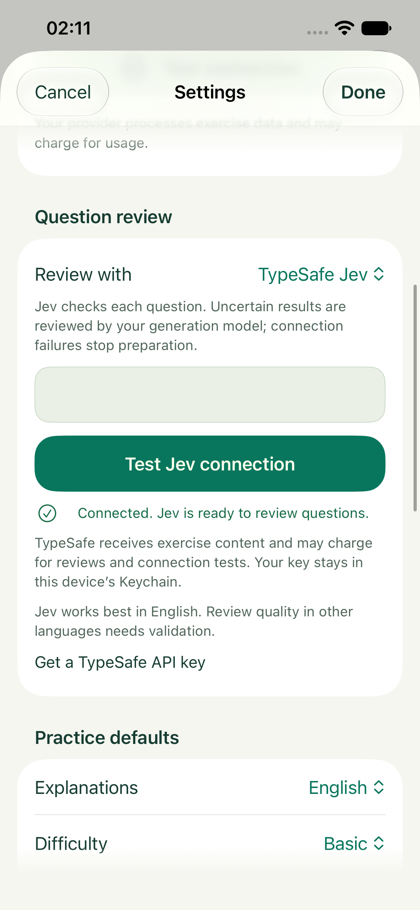
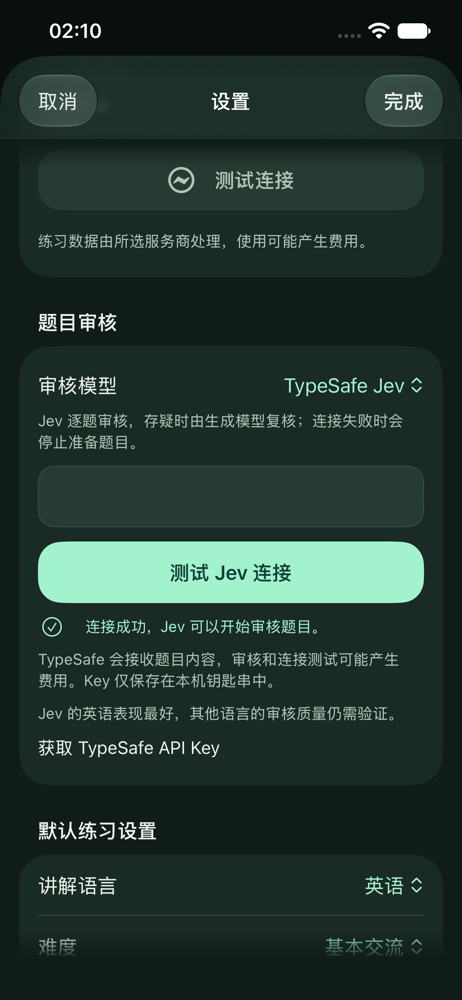

# 2026-09-22 可选 TypeSafe Jev 题目审核

最新界面已按用户反馈精简，见 [连接 UI 验收](Brand/Jev-Connection-UI-2026-09-22.md)。下文协议和存储行为继续适用。

## 用户流程

设置 → 题目审核 → TypeSafe Jev → 填入自己的 TypeSafe API Key → 测试 Jev 连接 → 完成。默认继续使用生成模型，不需要 TypeSafe 账号；切回“使用生成模型”即可停用 Jev。

Key 复用既有 Keychain 管理器，以独立 System One scope 隔离，仅保存在本机。测试和编辑都使用内存草稿，Done 才保存；取消不写入。删除 Key 同样先暂存，取消可保留原设置，Done 后删除并恢复生成模型审核。测试后修改 Key 必须重新验证。UI 测试使用隔离的 Keychain service 与合成响应，不触碰真实凭据。

题目内容和必要上下文会发送到 TypeSafe；连接测试、题目审核可能产生费用。有效但存疑的 Jev 判断会继续调用原生成模型复核，可能产生两次审核费用。认证、额度、限流、超时或响应格式错误停止本次准备，保留已经审核并保存的题目；错误不会自动绕过 Jev 或继续追加付费请求。

## 审核与效率

每题流程为：生成 → 本地校验和去重 → Jev 判断 → 必要时原模型复核 → 通过后立即保存。第一次生成、练习中补题及自动准备共用这条链路，模式在每次任务开始时固定。

Jev 是独立的 System One 判断服务，不冒充 Chat / Responses 生成接口。本轮锁定官方 `jev-1.13.0`，一个请求同时询问 14 项缺陷：安全主题、注入、事实、语言、上下文提示、游客角色、场景、自然度、文化、答案、难度和重复。代码逐项判断，不平均抵消缺陷；数值长度、结构和引用 allowlist 留在代码。

- 任一缺陷概率 ≥ 0.90：拒绝，沿用现有每候选位置最多两次重新生成的预算。
- 安全五项全部 ≤ 0.02，其他项全部 ≤ 0.10：直接通过，省去原生成模型的审核调用。
- 其他有效结果：原生成模型逐题完整审核。
- 缺项、额外判断键、错误类型、越界/非有限数字、错误模型版本：停止准备，不批准题目。

阈值属于初始版本 `prompti-jev-review-1`，未在 Prompti 真实语料上完成校准。模型概率不等于已经证明的安全或质量保证。官方说明英语是当前主要训练语言，其他语言（包括 CJK）的准确度不等；设置显示该边界。

每题仍至少发生一次生成和一次审核请求。收益来自用简短类型化判断替代长文本审核；不确定结果反而多一次调用。真实收益取决于 Jev 耗时、回退比例、拒绝率及原模型速度，本轮没有真实付费测量，不报告虚构的提速百分比、token 节省或费用承诺。

## 实现约束

- `POST https://api.typesafe.ai/v1/systemone`，Bearer key，`{model,state,questions}`，Noul 返回 `{type:"noul",noul:number}`；无独立 confidence 字段。
- 各判断完整描述条件；所有 state 是不可信数据。只发送题目必要字段、目的地、所选场景、语言/难度、许可事实及最近 30 条题干，不发送 UUID、凭据、用户标识或完整历史。
- 单次请求 30 秒，同时受整组截止约束；复用拒绝重定向、2 MB 限额和取消语义的传输层。不自动重试 TypeSafe 服务错误。
- 真实响应 token usage、失败、取消进入原用量账本；没有 usage 的请求保留“未知”。
- 新题保存可选审核来源、Jev 策略版本及判断值。旧题没有该元数据仍可解码，无 SwiftData schema 迁移。
- 场景审核、口语评分、计分、历史作答和库存去重保持既有流程。

## 验证

- Simulator 构建、Swift 严格并发及 warnings-as-errors 通过；保留 Xcode 未依赖 AppIntents 时的元数据提取提示。
- 137 项单元 / 合约 / 持久化测试通过，覆盖默认关闭、缺 Key 提前停止、通过/拒绝/存疑路由、错误响应、限流/认证/重定向、取消、长度上限、Keychain 隔离、用量和老题兼容。故障保留已通过题，不自动重新补题。
- UI 回归覆盖英语浅色、中文深色的空 Key 限制、测试成功、修改 Key 后验证失效、取消不保存；快速练一题自动进入、提前结束练习的现有用例也通过。
- 最终两项设置 UI 回归通过（`/tmp/Prompti-Jev-0922-settings-final.xcresult`）：新增保存成功、再次打开保留配置、取消删除保留 Key、确认删除恢复默认、删除后重新启用需重新提供并验证 Key。删除按钮显式使用 borderless 样式，避免 Form 中整行默认按钮行为干扰操作。
- 最后一次单测：`/tmp/Prompti-Jev-0922-final.xcresult`，137 项全部通过；该包的设置 UI 包含修复前失败，以后续 settings-final 包为准。
- `CheckBrand.py`、`CheckLocalization.py --stringsdata`（678 catalog entries、185 动态标签、340 编译提取使用）及 `git diff --check` 通过。
- iPhone 17e 模拟器 / iOS 27.0，默认字号，英语浅色与中文深色已实际检查：审核选择、Key 输入、测试按钮、状态、费用/语言说明和获取 Key 链接可读，没有裁切。未声称完成全面 VoiceOver 或非常规超大字号验收。

137 项单测原始结果：`/tmp/Prompti-Jev-0922-unit2.xcresult`。首次 UI 回归发现 iOS 将 SecureField 当成登录密码弹出“保存密码”；已调整输入内容类型、关闭自动大写/纠错并主动收起键盘，复测通过（`/tmp/Prompti-Jev-0922-ui2.xcresult`，4 项）。

未进行真实 Jev / 生成模型调用、真实 Key 验证、物理 iPhone 安装、多语言人工质量评测或延迟基准。UI 截图来自实际运行的 App，但连接使用 DEBUG 合成响应；安全输入字段在截图中由系统隐藏。没有把模拟连接成功当成真实服务通过。

## 实际 App 截图

| English / 浅色 | 简体中文 / 深色 |
| --- | --- |
|  |  |

[截图清单](GenerationReview/2026-09-22/jev-manifest.json)保留测试名称、设备及时间。截图中的连接成功使用合成响应，仅代表界面流程验证。

## 官方依据

本轮在线核对：

- [HTTP API](https://docs.typesafe.ai/api.md)：请求、返回和错误状态。
- [模型](https://docs.typesafe.ai/models.md)：`jev-1.13.0`、版本锁定、语言表现及上下文限制。
- [Noul](https://docs.typesafe.ai/primitives/noul.md)：独立 yes/no 概率，批量并行判断和代码阈值。
- [Guardrails cookbook](https://docs.typesafe.ai/cookbooks/llm_guardrails.md)：逐项风险判断、明确政策和存疑复核。
- [Jev 1.13 已知边界](https://docs.typesafe.ai/model-jaggedness/jev-1.13.md)：数学/计数留在代码，精确描述条件，测试对抗内容。
